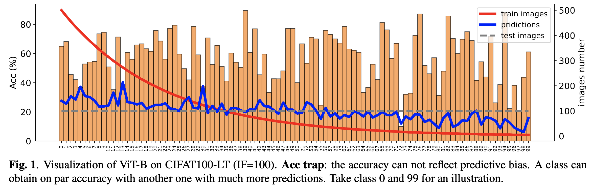

# RETHINK LONG-TAILED RECOGNITION WITH VISION TRANSFORMERS

Zhengzhuo Xu1, Shuo Yang1, Xingjun Wang1, Chun Yuan

This repository is the official PyTorch implementation of the [paper](https://arxiv.org/abs/2302.14284) in ICASSP 2023.
&nbsp;
<p align="center">

</p>
&nbsp;

We propose Prediction Distribution Calibration (PDC) to quantitatively evalate how proposals overcome model head preferance in LTR.


## Usage
```python
from eval import evaluate_all_metric

model, dataloader = None, None
# build your owen cls mode and image dataloader
device = 'cpu'
cls_num = None # list
# get train label distribution
res = evaluate_all_metric(
    dataloader,
    model,
    device,
    cls_num
)
pdc = res['pdc']
```

We will release the training code with ViTs soon.

## Citation
If you find our idea or code inspiring, please cite our paper:
```bibtex
@inproceedings{PDC,
  author       = {Xu, Zhengzhuo and
                  Yang, Shuo and
                  Wang, Xingjun and
                  Yuan, Chun},
  title        = {Rethink Long-Tailed Recognition with Vision Transforms},
  booktitle    = {{IEEE} International Conference on Acoustics, Speech and Signal Processing, {ICASSP} 2023},
  year         = {2023}
}
```

